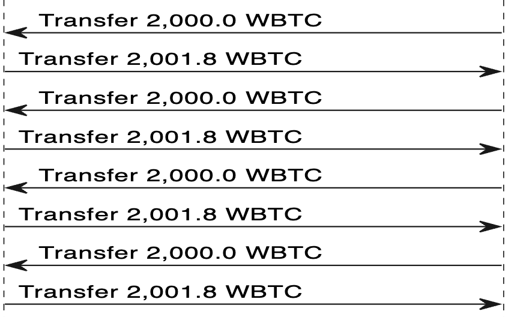

# HopeLend

HopeLend is an aave-v2 fork. When users deposit an asset, they earn interest on the deposit asset but it can also be used as collateral (at the same time) to borrow other assets.

## Overview

On October 18, 2023 11:48:59 AM +UTC, the HopeLend protocol was exploited for nearly all of its assets (~valued at around 528 ETH). The attack was carried out in two steps; First, the attacker artificially inflated the value of their WBTC collateral through repeated flashloaning and donating of WBTC, allowing them to drain practically all the assets from the other lending pool as "borrows" with no intention to repay. In the second step, the attacker exploited a precision loss bug to exit their own initial WBTC deposits.

Unfortunately for the attacker, however, their transaction was frontrun by a generalized frontrunner who paid an ~263 ETH to a miner, essentially splitting the proceeds of the exploit with miner.

## Technical Analysis

### Prerequisite Understanding

#### Solidity Fixed Point Math

A quick primer on Solidity math before this: _Solidity operates solely on whole numbers, lacking the capability to represent decimal values_. In the realm of financial applications, this absence is a critical limitation as a single unit of a token might carry substantial value, rendering fractional units essential for practicality. Moreover, the inability to handle fractions within a unit undermines the possibility of distributing interest payments involving fractions.

To solve this, Solidity developers use fixed-point arithmetic. Fixed point numbers are typically represented through a fixed amount of digits reserved for the decimal. For example, "103.345" represented with 3 decimals in Solidity would just be 103345 or `103.345e3` and number like "103.3456234" becomes impossible to represent with 3 decimals. Performing addition and subtraction with these representations is straightforward as these operations don't alter the decimal point. However, multiplication and division are more intricate since they can affect the decimal. When conducting these operations, knowing the desired decimals in the output is necessary for accurate truncation.

For example, in Solidity, multiplying `1.1 * 1.21` would result in `11 * 121 = 132`. However, `1.1 * 1.21` isn’t equal to 133.1. To interpret the result correctly, consider the sum of decimals in the factors (1 + 2 = 3), yielding `1.1 * 1.21 = 1.331`.

If the desired precision for the output is 1 decimal, truncation is necessary. This is achieved by dividing the result by `10 ** [resultingPrecision - desiredPrecision]`, which in this case is `10 ** (3 - 1) = 10 ** 2`. In Solidity, this becomes `1331 / 10**2 = 13`, interpreted as 1 decimal (1.3). It's important to note the loss of precision in this process.

#### Rebasing Tokens

Aave's `aToken`s (and therefore HopeLend's `hToken`s) are rebasing tokens. To understand the root of this exploit, it is important to understand how these tokens are represented in the smart contract. From the user's perspective, rebasing is used as a mechanism to distribute interest to lenders. For example, if a user has 10 `aToken`s, and the protocol wanted to distribute 10% interest, this user's balance would change automagically from 10 -> 11.

This is made possible by representing a user's balance dynamically as a function of two different values: a static balance of "credits" (or a "normalized balance") and a valuation for each of these "credits". The normalized balances (or credits) are stored in a user-indexed mapping. And there is one global valuation for the credits (called the `liquidityIndex` in aave). So a user's true balance at any moment is `normalizedBalance[user] * liquidityIndex`.

However, there is an additional nuance for this calculation in the contract. In Aave, `normalizedBalance`s are represented with 18 decimals, `liquidityIndex` is represented with 27 decimals initialized to `1e27`, and the true balance is outputted as 18 decimals. So the true calculation for true balance at any moment is `normalizedBalance[user] * liquidityIndex / 10**27` interpreted as an 18 decimal number.

**Below is an example `user1`'s `trueBalance` as their `normalizedBalance` changes**

| `normalizedBalance[user1]` | `liquidityIndex` | `trueBalance` |
| -------------------------- | ---------------- | ------------- |
| 1                          | 1e27             | 1             |
| 2                          | 1e27             | 2             |
| 3                          | 1e27             | 3             |
| 0.5e18                     | 1e27             | 0.5e18        |
| 1e18                       | 1e27             | 1e18          |

**How about if the `liquidityIndex` changes?**

| `normalizedBalance[user1]` | `liquidityIndex` | `trueBalance` |
| -------------------------- | ---------------- | ------------- |
| 1                          | 7e27             | 7             |
| 2                          | 7e27             | 14            |
| 3                          | 7e27             | 21            |

For most lending protocols, it is highly improbable to witness a `liquidityIndex` reaching `7e27`. These protocols typically allocate APYs within the single to low double digits, making a substantial surge in the `liquidityIndex` remarkably unlikely. Remember, the increase factor in the `liquidityIndex` directly corresponds to the interest disbursed to lenders. Most `liquidityIndex`es hover slightly above `1e27`.

However, using `7e27` demonstrates an interesting relationship between the `liquidityIndex` and the `trueBalance`. Since there is no fractional value between 0 and 1 that could be used for `normalizedBalance`, it actually _becomes impossible to represent a `trueBalance` between 0 and 6_. So we can come to one very important conclusion: as the `liquidityIndex` increases, the spectrum of representable numbers in `trueBalance` diminishes, resulting in a loss of precision! Lending protocols like Aave operate on the assumption that `liquidityIndex` values stay low to maintain precision on arithmetic operations, which in most cases, is a relatively safe assumption to make.

#### Rounding in Aave (and HopeLend)

The standard rounding practice in Solidity is to floor. Aave implements their own rounding that utilizes proper rounding (round up if the value is >= 0.5, otherwise round down). For example, in vanilla Solidity, `3 / 2 = 1` because 1.5 will get floored. However, the Math used by Aave would actually round this up to 2.

### The Attack

Here are the steps of the attack:

1. 2300 WBTC flashloan from Aave.
2. 2000 WBTC deposited into **empty** HopeLend WBTC pool.

- This mints 2000 hEthWBTC to represent the attacker's claim on the pool funds.

At this point, this 2000 WBTC is the _only_ funds in the pool and this 2000 hEthWBTC is the total supply.

3. Flashloan 2000 WBTC from HopeLend WBTC pool
4. _Donate_ 2000 WBTC back to the HopeLend WBTC pool

The donation here is significant because it does _not_ mint hEthWBTC as a claim.

5. Redeem 1999.99999999 hEthWBTC for 1999.99999999 WBTC

Now there is 1e-8 WBTC in the pool (this is the smallest representable number for WBTC since WBTC has 8 decimals). The total supply of hEthWBTC is 1e-8 (held by the attacker) and there is an outstanding flashloan of 2000 WBTC against the attacker's account. So this state is already pretty fishy--how can there be a flashloan amount greater than the total supply?

6. Repay the flashloan of 2000 WBTC with 1.8 WBTC of interest

So this is where everything breaks.

```
1 function _handleFlashLoanRepayment(
2     DataTypes.ReserveData storage reserve,
3     DataTypes.FlashLoanRepaymentParams memory params
4   ) internal {
5     uint256 premiumToProtocol = params.totalPremium.percentMul(params.flashLoanPremiumToProtocol);
6     uint256 premiumToLP = params.totalPremium - premiumToProtocol;
7     uint256 amountPlusPremium = params.amount + params.totalPremium;
8
9     DataTypes.ReserveCache memory reserveCache = reserve.cache();
10    reserve.updateState(reserveCache);
11    reserveCache.nextLiquidityIndex = reserve.cumulateToLiquidityIndex(
12    IERC20(reserveCache.aTokenAddress).totalSupply() +
13        uint256(reserve.accruedToTreasury).rayMul(reserveCache.nextLiquidityIndex),
14        premiumToLP
15    );
16
      // ...
  }
```

This is a snippet from the HopeLend codebase that handles the repayment of the flashloan. The `premiumToProtocol` is calculated as a percentage of the `params.totalPremium`. Total premium in this case is the 1.8 WBTC. In this transaction, the premium is split between the protocol and the LP 30-70. So 70% (1.26 WBTC) will be distributed to the lenders.

Line 12 - `cumulateToLiquidityIndex()`

```
1  function cumulateToLiquidityIndex(
2    DataTypes.ReserveData storage reserve,
3    uint256 totalLiquidity,
4    uint256 amount
5  ) internal returns (uint256) {
6    //next liquidity index is calculated this way: `((amount / totalLiquidity) + 1) * liquidityIndex`
7    //division `amount / totalLiquidity` done in ray for precision
8    uint256 result = (amount.wadToRay().rayDiv(totalLiquidity.wadToRay()) + WadRayMath.RAY).rayMul(
9      reserve.liquidityIndex
10   );
11   reserve.liquidityIndex = result.toUint128();
12   return result;
13 }
```

This snippet displays the math for increasing the `liquidityIndex` (how interest is distributed). When `_handleFlashloanRepayment()` called `cumulateToLiquidityIndex()`, it passed in `hEthWBTC.totalSupply()` (which is 1) as `totalLiquidity` (the `accruedToTreasuryAmount` can be ignored since it is zero) and `1.26e8` as amount (WBTC has 8 decimals).

`(amount.wadToRay().rayDiv(totalLiquidity.wadToRay())` is dividing the total reward by the total lender liquidity to calculate how much reward each unit of lender liquidity should get with an output precision of 27 decimals and simplifies to `amount * 1e27 / totalLiquidity`. Under normal circumstances this would be number much smaller than `1e27` since it would be expected that the reward distributed would be less than the total liquidity in the system... but this assumption was broken. This expression calculated `1.26e8 * 1e27 / 1 = 126_000_000_000_000_000_000_000_000_000_000_000`. This value means that the contract wants to distribute a 126_000_000x or (126_000_001 \* 100)%!

`... + WadRayMath.RAY)`.

This expression adds simply adds 1e27.

So we have `126_000_000_000_000_000_000_000_000_000_000_000 + 1e27 = 126_000_001_000_000_000_000_000_000_000_000_000`. And this value is multiplied to the current `liquidityIndex` (1e27) with proper handling of precision `126_000_001_000_000_000_000_000_000_000_000_000 * 1e27 / 1e27`. So the `liquidityIndex` just went from 1e27 to `126_000_001e27`. Recall from [Rebasing Tokens](#rebasing-tokens) that `liquidityIndex`es are expected to hover slightly above 1e27 and that as it grows larger and larger, the precision loss scales with it... this spike is clearly a problem...

This spike also affected how the protocol was valuing the collateral. The attacker's 1e-8 worth of hEthWBTC was now worth `1e-8 * 126_000_001` of WBTC (accounting for precision, this equates to 1.26000001 WBTC). Meanwhile there is only 1e-8 WBTC sitting in the contract... this is bad.

However, the `liquidityIndex` manipulation did not stop there.

7. The attacker went on to continue this process of flashloaning 2000 WBTC and repaying 2001.8 WBTC ~60 more times!



At the end of this stage, the `liquidityIndex` was `7_560_000_001_000_000_000_000_000_009_655_610_336` or 7560000001e27. Now, the attacker's 1e-8 hEthWBTC was valued at 75.60000001 WBTC! This was enough collateral to drain all the other pools in the system.

So that concludes the first half of this attack.

The second half of this attack is to exit the initially donated WBTC to repay the very first 2300 WBTC flashloan.

This is where precision loss from the large `liquidityIndex` will come into play.

8. Deposit 151.20000002 WBTC

At a `liquidityIndex` of `7_560_000_001_000_000_000_000_000_009_655_610_336`, this mints 2 `hToken`s.

9. Withdraw 113.4 WBTC from the pool.

The value 113.4 was carefully chosen. `113.4 / 75.60000001 = 1.49999999`. So with the current `liquidityIndex`, to service a withdrawal of 113.4 WBTC, 1.49999999 hTokens would need to be burned. Since this has a decimal, it will need to be rounded. This is just below the threshold for being rounded up, as covered in [Rounding in Aave](#rounding-in-aave-and-hopelend). So it gets floored and only 1 hToken is burned from the attacker's balance.

10. Repeatedly deposit 75.60000001 and mint 1 hEthWBTC and then withdraw 113.4 WBTC by burning 1hEthWBTC

| `normalizedBalance[attacker]` | `liquidityIndex`                                  | `trueBalance` |
| ----------------------------- | ------------------------------------------------- | ------------- |
| 1                             | 7_560_000_001_000_000_000_000_000_009_655_610_336 | 75.60000001   |
| 2                             | 7_560_000_001_000_000_000_000_000_009_655_610_336 | 151.20000002  |

11. Repay initial Aave flashloan + fee.

## Implications for Ion V1

The current iteration of Ion Protocol is not vulnerable to this type of attack. First of all, collaterals do not follow the same two-factor valuation that HopeLend's did since Ion's markets are isolated (at least on the collateral side). While there is the effect of losing precision as `rate`s and `supplyFactor` rise, there is no way for these values to be manipulated the way HopeLend's was. But even in the off-chance there was a way to do it, Ion always rounds in the protocol's favor so there would be no economic incentive for an attacker to perform it. The inflation would be unideal for UX but the protocol would remain solvent.
